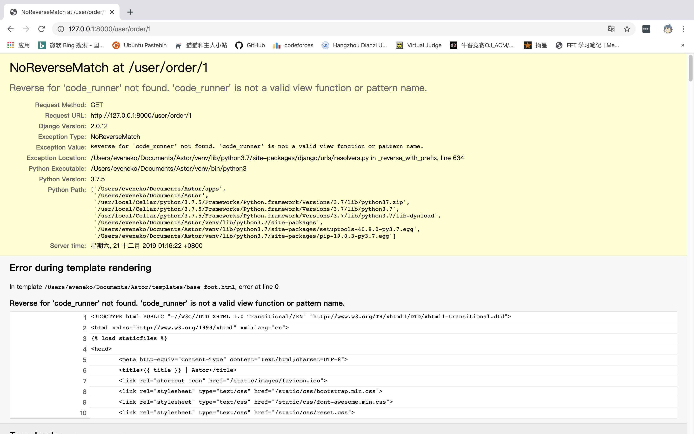
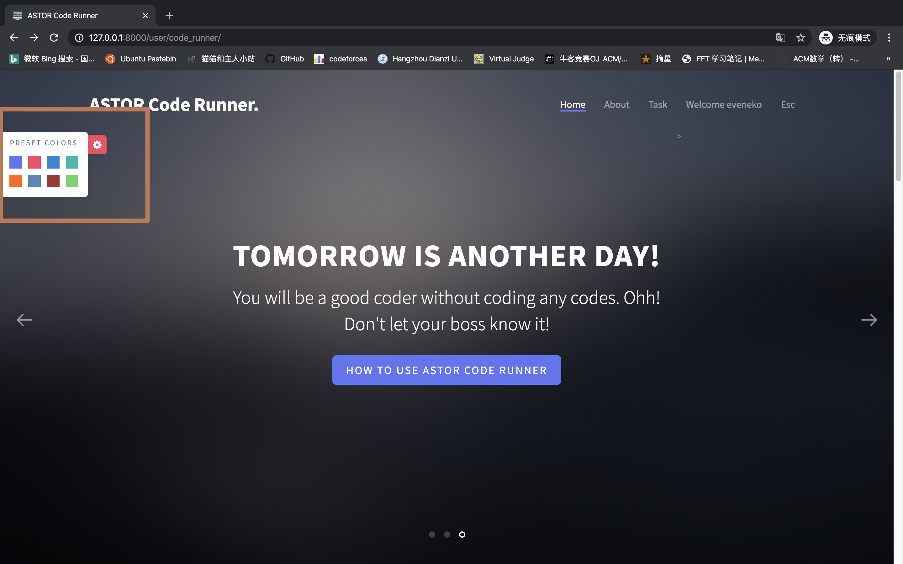
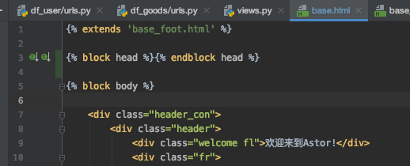
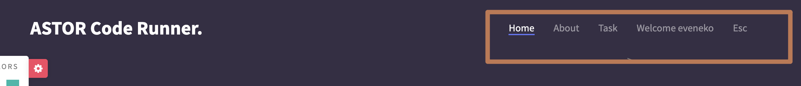
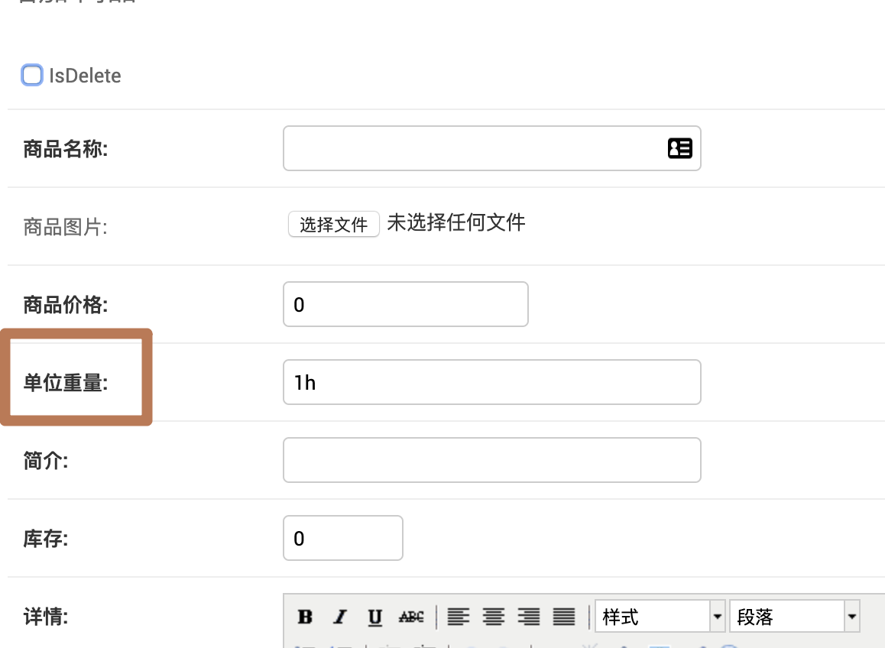

# Record

## Bug

1. ~~删除所有算法，添加算法test1 -> 大厅点击算法 -> 立即购买 -> 支付 -> 支付成功 -> bug~~  

      
    
    **修复：路由表无法热加载，重启即可**

2. 背景色自调节无效

    

## Contribution

1. `base.html` addition

    ```python
    
    ```

    

2. 把Code-runner页面加入ASTOR，修改了前端header，将原header融入进来

    

3. 

## Fork

1. 数据库商品 -> 单位重量


2. 
